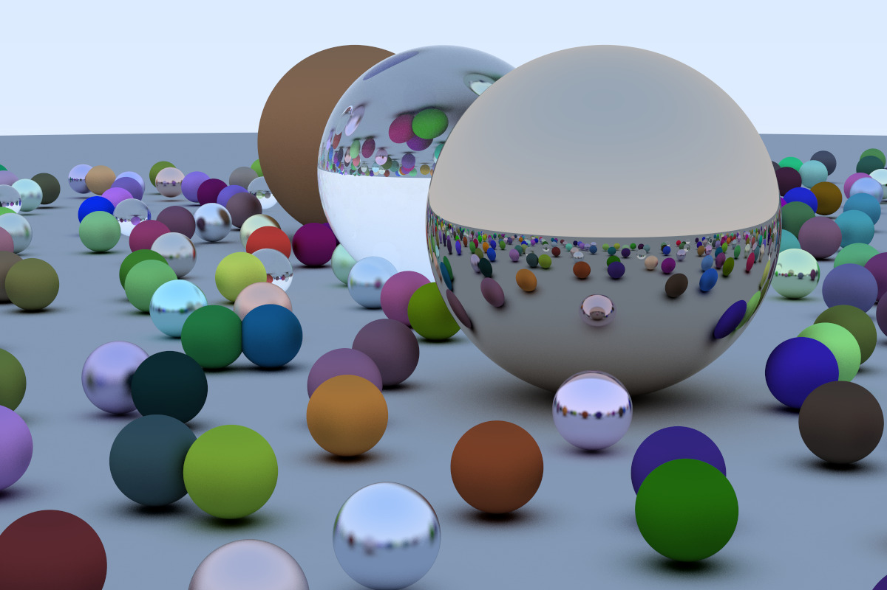
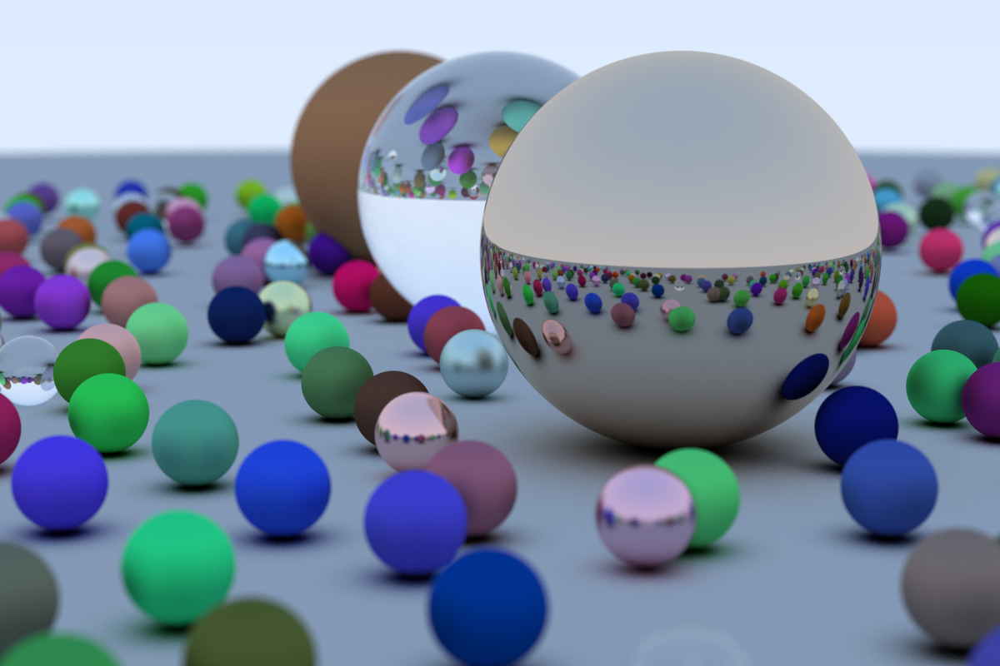

# RayTracer

Implementation of a ray tracer in Rust, following [_Ray Tracing in One Weekend_](https://raytracing.github.io/books/RayTracingInOneWeekend.html).

Sample rendering:

```bash
cargo run --release -- --world=random --seed=42 \
        --aspect_ratio="3:2" --image_width=1200 --samples_per_pixel=500 \
        > test.ppm
```



Same with focus blur:

```bash
cargo run --release -- --world=random --seed=42 \
        --aspect_ratio="3:2" --image_width=1200 --samples_per_pixel=500 \
        --aperture=0.1 --focus_dist=10.0 \
        > test.ppm
```


