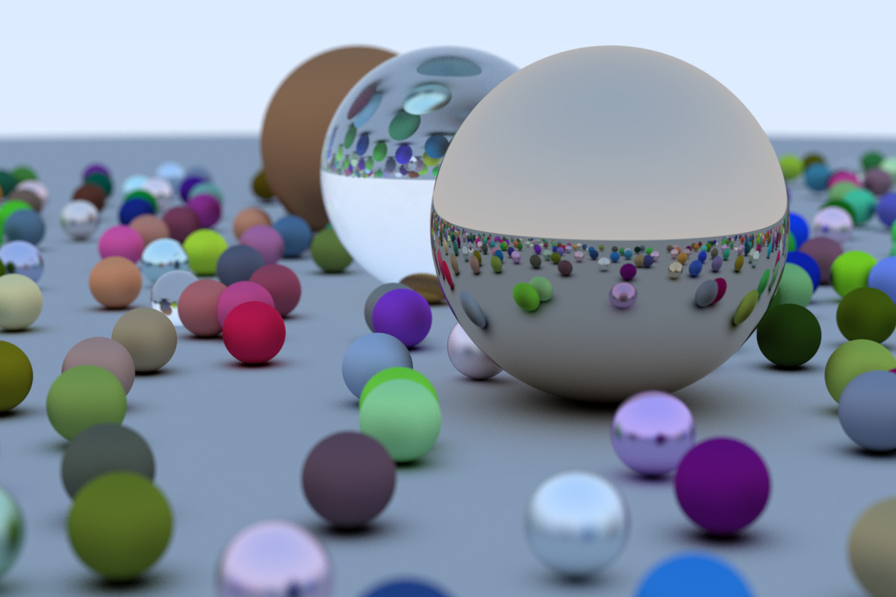
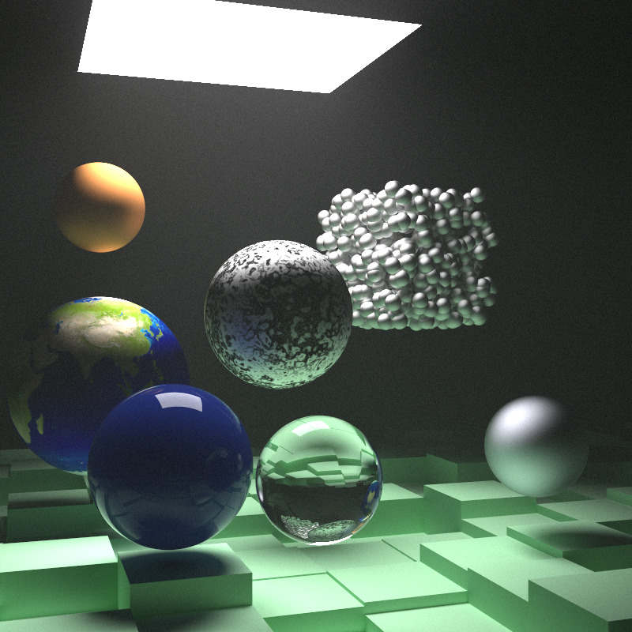

# RayTracer

Implementation of a ray tracer in Rust, following [_Ray Tracing in One Weekend_](https://raytracing.github.io/books/RayTracingInOneWeekend.html) 
and [_Ray Tracing: The Next Week_](https://raytracing.github.io/books/RayTracingTheNextWeek.html) .

Sample rendering from "... in One Weekend".

```bash
cargo run --release -- --world=random --seed=42 \
        --aspect_ratio="3:2" --image_width=1200 --samples_per_pixel=500 \
        > test.ppm
```


Same with focus blur:

```bash
cargo run --release -- --world=random --seed=42 \
        --aspect_ratio="3:2" --image_width=1200 --samples_per_pixel=500 \
        --aperture=0.1 --focus_dist=10.0 \
        > test.ppm
```



Final scene from "... The Next Week":

```bash
cargo run --release -- --world=final_scene --seed=42 \
        --aspect_ratio='1:1'  --image_width=800 \
        --samples_per_pixel=10000 \
        > test.ppm
```


(something is wrong with Perlin noise here)
